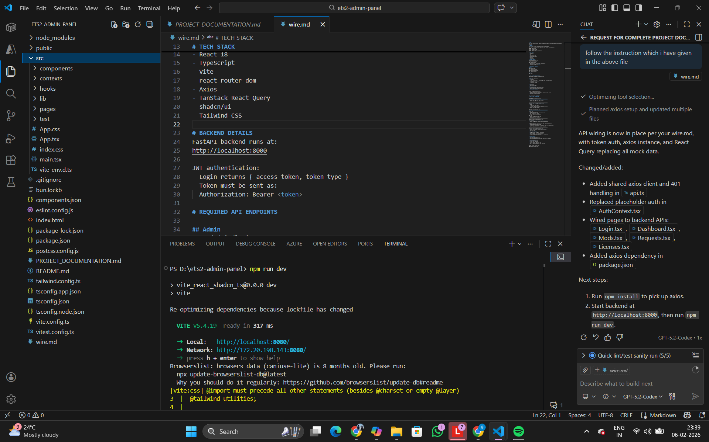

# ROLE
You are a senior frontend engineer integrating a React + Vite admin panel with a FastAPI backend.

# CONTEXT
This project already has a COMPLETE UI with mock data.
Your task is to REPLACE mock logic with real backend API integration.

DO NOT redesign UI.
DO NOT change routing.
DO NOT remove shadcn/ui components.
DO NOT add new pages.

# TECH STACK
- React 18
- TypeScript
- Vite
- react-router-dom
- Axios
- TanStack React Query
- shadcn/ui
- Tailwind CSS
](image.png)
# BACKEND DETAILS
FastAPI backend runs at:
http://localhost:8000

JWT authentication:
- Login returns { access_token, token_type }
- Token must be sent as:
  Authorization: Bearer <token>

# REQUIRED API ENDPOINTS

## Admin
POST /admin/login
POST /admin/upload-mod
GET  /admin/mod-requests
POST /admin/generate-key
GET  /admin/licenses

## Public
GET /mods

# AUTH INTEGRATION (CRITICAL)

Replace the placeholder AuthContext logic.

## Login
- Call POST /admin/login
- On success:
  - Store access_token in localStorage (key: ets2_admin_token)
  - Set authenticated state
- On failure:
  - Show error message

## Logout
- Clear token
- Redirect to /login

## Route Protection
- If token missing → redirect to /login
- Remove fake localStorage flag logic

# AXIOS SETUP (REQUIRED)

Create a single Axios instance:
- baseURL: http://localhost:8000
- Automatically attach Authorization header if token exists
- Handle 401 by forcing logout

Use this instance everywhere.

# PAGE-BY-PAGE INTEGRATION

--------------------------------------------------
LOGIN PAGE (src/pages/Login.tsx)
--------------------------------------------------
- Replace fake login with real API call
- Handle loading & error states

--------------------------------------------------
DASHBOARD PAGE (src/pages/Dashboard.tsx)
--------------------------------------------------
- Fetch:
  - mods count (GET /mods)
  - pending requests count (GET /admin/mod-requests)
  - licenses count (GET /admin/licenses)
- Replace hard-coded numbers

--------------------------------------------------
MODS PAGE (src/pages/Mods.tsx)
--------------------------------------------------
UPLOAD MOD:
- Replace alert with POST /admin/upload-mod
- Use multipart/form-data
- Show success/error toast
- Refresh mod list after upload

MOD LIST:
- Replace mockMods with GET /mods
- Map backend fields correctly

--------------------------------------------------
REQUESTS PAGE (src/pages/Requests.tsx)
--------------------------------------------------
LIST REQUESTS:
- Replace mockRequests with GET /admin/mod-requests

GENERATE KEY:
- Replace random key generation with POST /admin/generate-key
- Key must be shown ONCE in modal
- Do NOT store generated key in component state after modal closes
- Update request status from backend response

--------------------------------------------------
LICENSES PAGE (src/pages/Licenses.tsx)
--------------------------------------------------
- Replace mockLicenses with GET /admin/licenses
- Read-only table

# DATA HANDLING RULES
- Use React Query (useQuery, useMutation)
- Handle loading, error, success states
- Do NOT keep duplicate local state for server data
- Backend is the source of truth

# SECURITY RULES
- Never hardcode tokens
- Never log tokens to console
- Never store generated license keys long-term in frontend

# OUTPUT EXPECTATION
- Fully wired admin panel
- No mock data remaining
- Clean, readable TypeScript code
- Minimal refactoring
- Same UI behavior as before, but real data

DO NOT include backend code.
DO NOT include explanations.
ONLY update frontend code.
